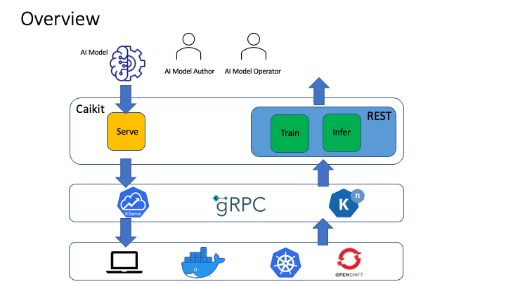

# Key concepts: inferencing and training models with Caikit
{: .no_toc }

To use Caikit to manage your AI model, you must first define the following two key components:

- [Module](https://github.com/caikit/caikit/blob/main/docs/adrs/001-module.md): The `module` defines the entry points for Caikit to manage your model. In other words, it tells Caikit how to load, infer, and train your model. An example is the [text sentiment module](https://github.com/caikit/caikit/blob/main/examples/text-sentiment/text_sentiment/runtime_model/hf_module.py).

- [Data model](https://github.com/caikit/caikit/blob/main/docs/adrs/010-data-model-definition.md): The `data model` defines the input and outputs of the model task. An example is the [text sentiment data model](https://github.com/caikit/caikit/blob/main/examples/text-sentiment/text_sentiment/data_model/classification.py).

The model is served by a [gRPC](https://grpc.io) server that can run as is or in any container runtime, including [Knative](https://knative.dev/docs/) and [KServe](https://www.kubeflow.org/docs/external-add-ons/kserve/kserve/). Here is an example of the [text sentiment server code for gRPC](https://github.com/caikit/caikit/blob/main/examples/text-sentiment/start_runtime.py). This example references the module configuration [in this config.yaml file](https://github.com/caikit/caikit/blob/main/examples/text-sentiment/models/text_sentiment/config.yml). This configuration specifies the module(s) (which wraps the model(s)) to serve.

## Examples

[This example of a client](https://github.com/caikit/caikit/blob/main/examples/text-sentiment/client.py) is a simple Python CLI that calls the model and queries it for sentiment analysis on two different pieces of text. The client also references the module configuration.

Check out the full [Text Sentiment example](https://github.com/caikit/caikit/tree/main/examples/text-sentiment) or the [model user tutorial](./docs/tutorial_appdev.md) to understand how to load and infer a model using Caikit.
